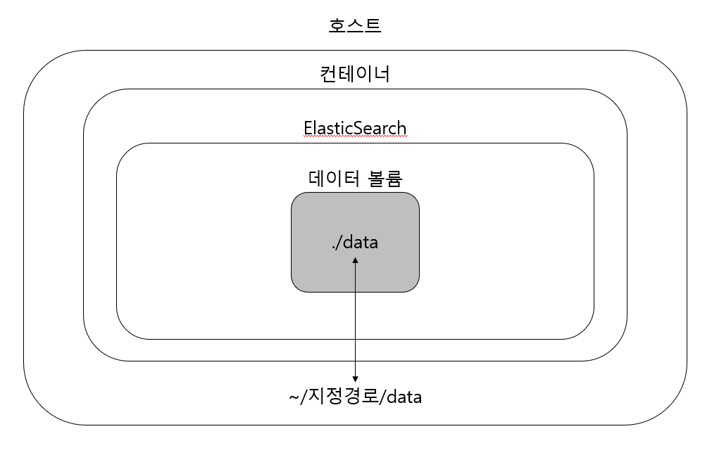

# commentSearchApplication
댓글 검색 어플리케이션   

## 1. 목표
+ 1단계 : 색인 및 검색(id/full-text) 구현.   
+ 2단계 : aggregation 을 이용한 다양한 결과 도출   

## 2. application 구성

Docker와 ElasticSearch 를 사용했다.   
일반적으로 기업에서 리눅스를 사용해 서비스를 제공하기 때문에 환경을 맞춰주기 위해서 Docker를 사용했다.
elasticsearch는 RDBMS와 비교하여 트랜잭션 ACID(원자성, 일관성, 고립성, 지속성) 를 보장할수 없어서 데이터 유실이 생길 수 있다.   
그러나 data를 새로 입력하거나 수정할 일이 없고 검색에는 좋은 성능을 유지할 수 있다.   
또한 전문검색을 BIGRAM 으로 제공하기 위하여 elasticsearch 를 사용했다.
container의 데이터 휘발성 때문에 색인한 파일이 사라지기 때문에 data의 영속성을 위해 volume을 사용했다.   

## 3. docker 실행 command
elasticsearch 설치   
`docker image pull elasticsearch:6.8.7`   

elasticsearch 실행   
`docker run -v /c/ToyProject/data:/usr/share/elasticsearch/data -p 9200:9200 -p 9300:9300 -e "discovery.type=single-node" docker.elastic.co/elasticsearch/elasticsearch:6.8.7`

ping
`curl XGET- "hostip:9200"`

## 4. 댓글 색인 필드 타입

## 5. 실행 결과
